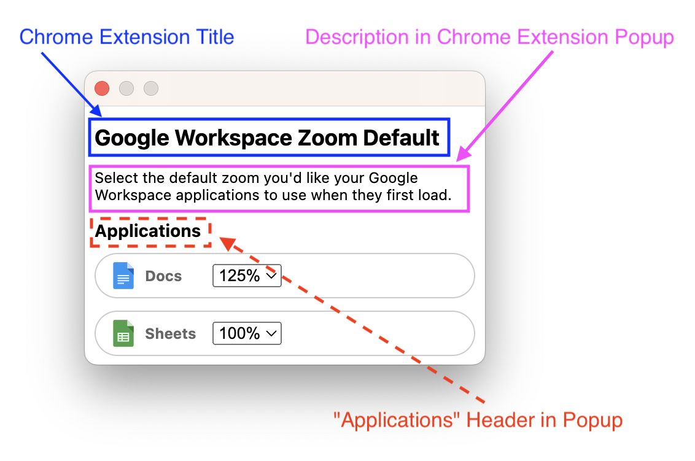

## Localisation Request

- [ ] Update existing translation
- [ ] Add support for new locale

## Locale

**What locale are you looking to update or add?**

<INSERT_LOCALE>

## Localisation Information

### Image for Context

### Localisation Values

#### Chrome Extension Title

**English:** "Google Workspace Zoom Default"
**New Translation:** "<INSERT>"

#### Chrome Web Store Description

**English:** "Set the default zoom of your Google Workspace application when first loading it."
**New Translation:** "<INSERT>"

#### Description in Chrome Extension Popup (_purple_)

**English:** "Select the zoom level you'd like your Google Workspace Applications to use when they first load."
**New Translation:** "<INSERT>"

#### "Applications" Header in Popup (_red dotted_)

Note: "Applications" refers to the Google Workspace applications such as "Google Docs" or "Google Sheets"

**English:** "Applications"
**New Translation:** "<INSERT>"
