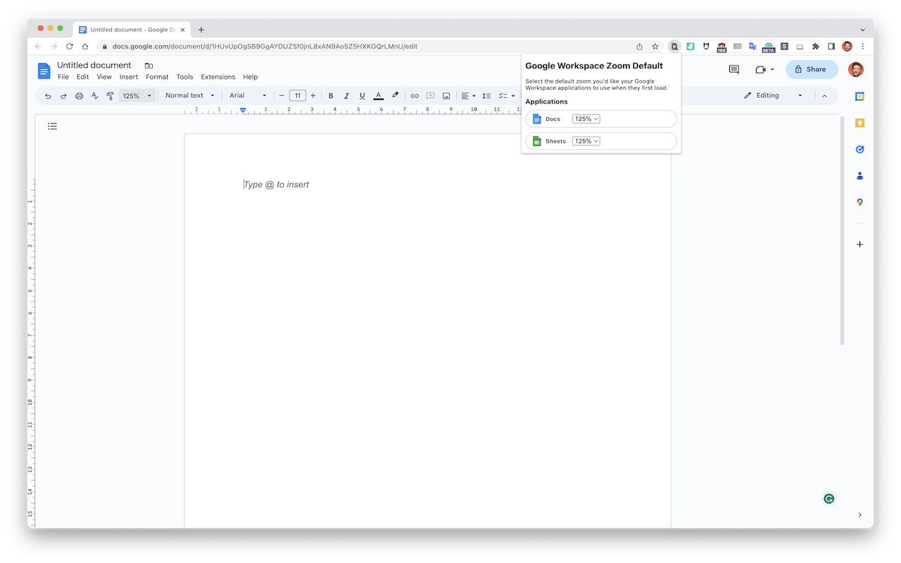
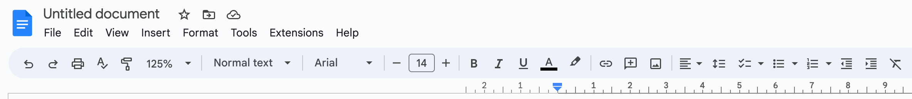

# Google Workspace Zoom Default

[Find it on Chrome Web Store](https://chrome.google.com/webstore/detail/google-docs-zoom-default/nflkcdlimipkgbacnfnhfecjgmojhklo)

👉 I wrote a bit more about it on my blog both [when I first released it](https://words.byvernacchia.com/blog/my-first-chrome-extension/)
and [when I updated it](https://words.byvernacchia.com/blog/2023/03/introducing-google-workspace-zoom-default/)

See it in action on [YouTube](https://youtu.be/ZbcpamEBEPU)!

Supported Google Workspace Products:

- [x] Google Docs
- [x] Google Sheets
- [ ] Google Docs (view only permissions)
- [ ] Google Sheets (view only permissions)
- [ ] Google Slides (maybe)

| Google Docs                         | Google Sheets                         |
|-------------------------------------|---------------------------------------|
|  |  |

## Localisation

I'm a native English speaker, but want to provide this Chrome Extension for everyone. That being said,
I've used Google Translate the values for the Spanish language. I know they're probably not correct.

If you feel like helping me out, would be much appreciated if you could submit a new issue, using the
"[Update/Add Locale Information](https://github.com/vernak2539/chrome-extension-google-doc-default-zoom/issues/new/choose)"
issue template. Or, reach out to me, and we can have a chat!

## Does it work with the Google Docs redesign?

Yes, it should work with the new design! I didn't even have to do anything. I'll continue to monitor this as we go, but
if you see any problems please submit an issue!

**New Design**

**Current/Old Design**

## Motivation

I'm getting old (or my monitor is has too much resolution), which makes it harder to see the small text in Google Docs.

There are two ways to increase the size:

1. Use the "Zoom" feature in the Google Doc via the menu
2. Use the browser's zoom function

I don't like using the latter due to it changing zoom across loads of webpages. So, I tried to figure out how to progress
with the former (option #1 :wink:) via a Chrome Extension.

## Actually Doing It

I ended up using [Plasmo](https://docs.plasmo.com/) to get up and running quickly. Chrome Extensions are new to me, so
this allowed me to get started pretty quickly (still figuring out the messaging aspect between content scripts, background,
and popup :grimacing:).

Ended up getting a simple prototype built in a couple hours and submitted to the Webstore :crossed_fingers: (will update
if / when approved).

It's pretty bare bones now and likely will have some quirks. This is likely due to how Google Docs:

1. Doesn't provide a JS SDK to programmatically do things in Google Docs
   - If it does, please message me or open an Issue!
2. Is quite finicky when you try to simulate events (due to the first point)

Issues are always appreciated, and I'll try to answer accordingly. Please remember that I do this in my spare time and
Chrome Extensions and Plasmo are quite new to me.

## Data Privacy

This Chrome Extension will never collect or transmit any personal data.
